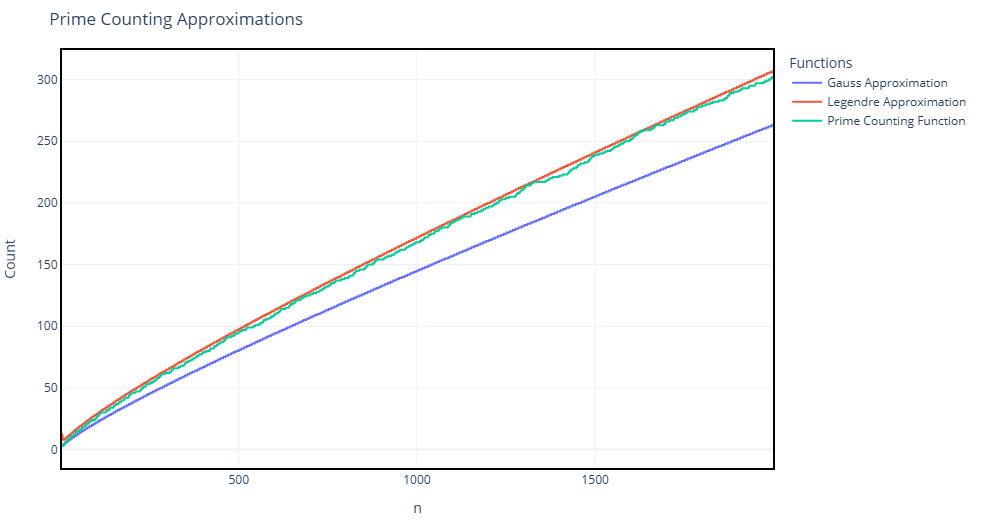

# Prime-Number-Theorem
## 📖 Background
Prime numbers are very important objects across eal world applications, such as cryptography, signal processing and coding theory. As we talk there is no way to know the exact postion of each prime number, instead, a lot of methods were developped in order to carry on tasks depending on caracterization of prime numbers, one very old attempt is Gauss approxiamtion formula or what we call Prime number theorem which tells us how primes thin out among larger numbers. It states that the number of primes less than or equal to $$x$$, denoted $$\pi(x)$$, is approximately: $$ \pi(x) \sim \frac{x}{\ln x} $$ This means primes become less frequent as numbers grow, but in a way we can predict. First proved in 1896 using complex analysis and the Riemann zeta function.

---

This repository presents a comparison of Gauss's and Legendre's formula in approximating the prime counting function $\pi(n)$, given by:
- $$\pi(n) \sim \frac{n}{log(n)}$$
- $$\pi(n) \sim \frac{n}{log(n)-1.08366}$$
- In fact, for any constant $b$:
- $$\pi(n) \sim \frac{n}{log(n)+ b}$$

The correctness of these approximations is rigorously proved, but for the seek of visualisation, we display the next figure:

  

**More discussion is conducted on the provided report**

---

## 📁 Contents

- `Report.pdf`: Theoritical explanation, implementation and results analysis.
- `Notebook.ipynb`: Implementation in Python.
- `prime_counting_approximations.png`: Figure showing the comparison.
---
## 🙋‍♂️ Author

Done by me **Marouf Haider** during my semester 07 as Cryptography Coding & Seurity student at National Higher School of Mathematics – December 2024.

---
##  Contact

📧 [Haider Marouf (School)](haider.marouf@nhsm.edu.dz)

📧 [Haider Marouf (Personal)](ensmmarouf@gmail.com)

---
> *⚠️ Disclaimer*: *This implementation and report were written as part of an educational project and may contain unintentional mistakes or limitations. If you encounter any issues or have suggestions, feel free to reach out*
